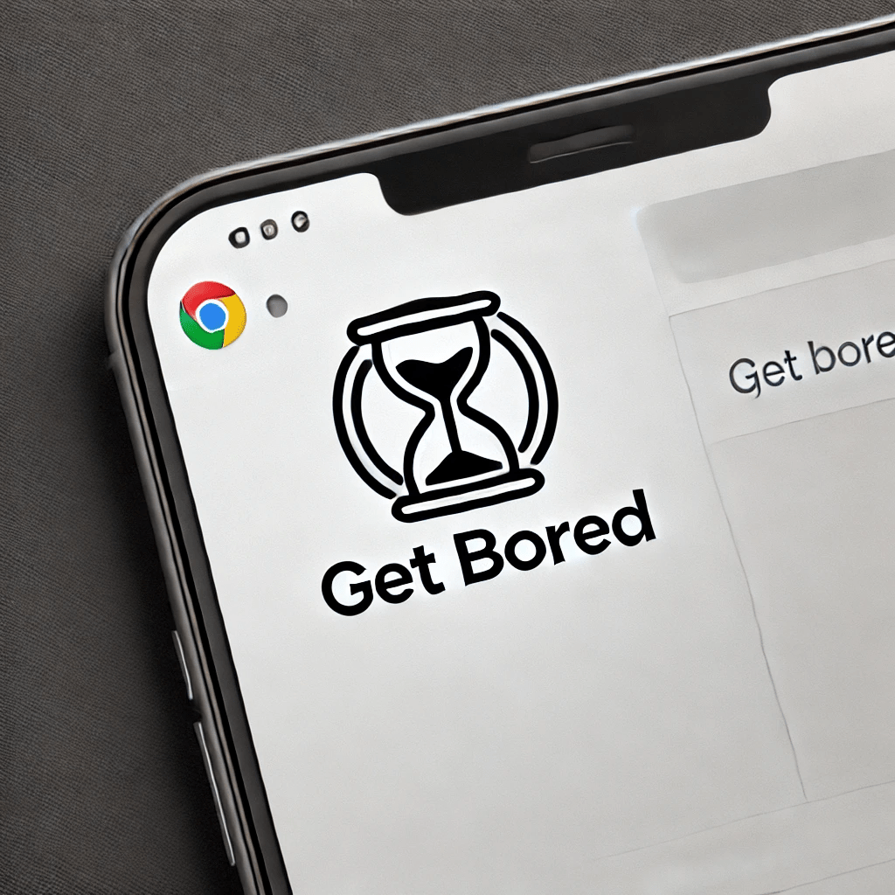
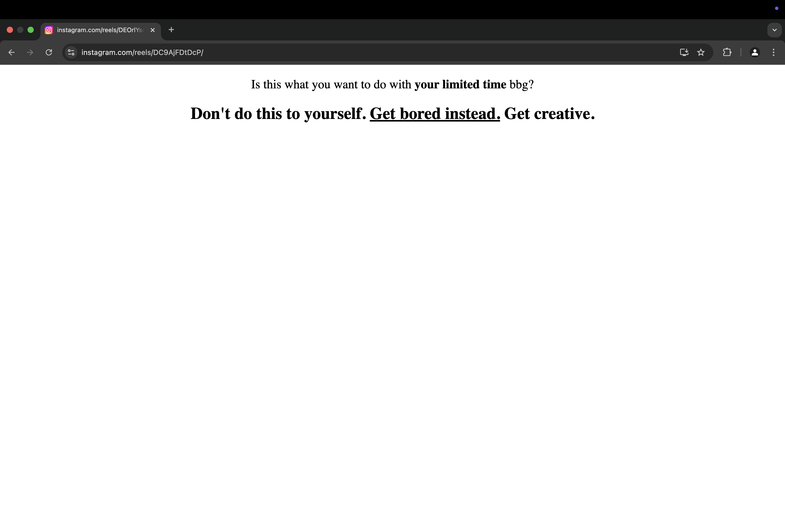

# Get Bored

A Chrome extension that hides the Reels and Explore button on Instagram. You can also specify your own list of sites to block access to.

## Features

- **anti-shorts mode:** blocks short form content (Instagram reels & explore, YouTube shorts & TikTok), and you can’t disable it for 12 hours once enabled 💪
- **custom blacklist/whitelist:** decide which sites to block or only allow specific ones.

## Installation

1. Clone this repo
2. Open Chrome and go to `chrome://extensions`
3. Enable `Developer mode` on the top right
4. Click on `Load unpacked` and select the folder of this repo
5. Done!
