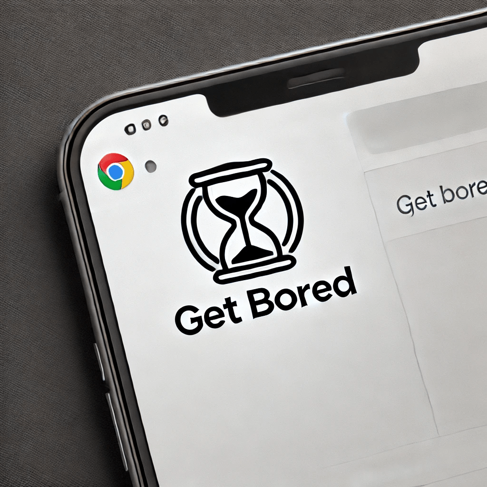
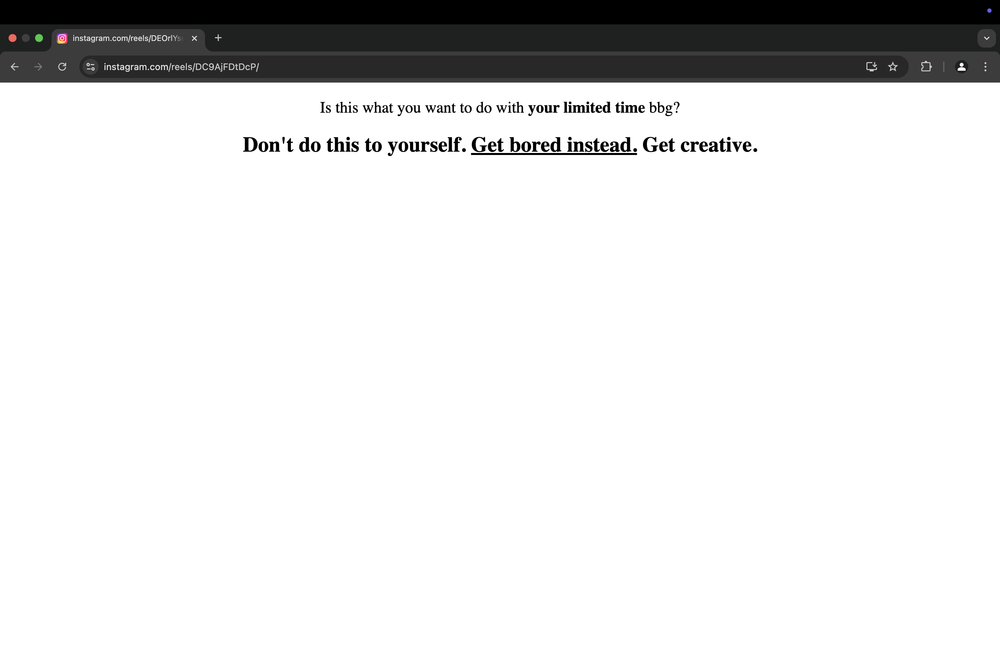

# Get Bored

A Chrome extension that hides the Reels and Explore button on Instagram. For Shorts on YouTube, those guys are pretty clever. They have a button, not a link. But don't worry. If you click the button, it will just clear the page.

## Blocked Pages

- Instagram
  - Reels
  - Explore
- YouTube
  - Shorts

## Installation

1. Clone this repo
2. Open Chrome and go to `chrome://extensions`
3. Enable `Developer mode` on the top right
4. Click on `Load unpacked` and select the folder of this repo
5. Done!
